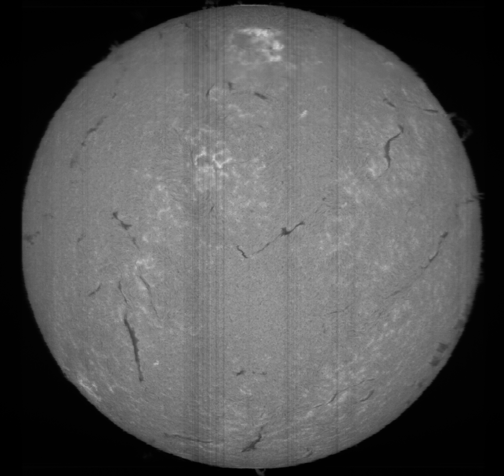

# JSol'Ex

JSol'Ex is an application to process [Sol'Ex](http://www.astrosurf.com/solex/) video files.
It is similar to [INTI](http://valerie.desnoux.free.fr/inti/) but is fully written in Java instead of Python.

## Features

JSol'Ex is currently experimental.
It was implemented as an exercise and doesn't have all the features of INTI.
Since I didn't have any idea of how INTI is performing its processing, I implemented my own algorithms.

In a nutshell, JSol'Ex will:

- read Sol'Ex video files, extracting frames and performing debayering if needed.
- perform Sun borders detection via contrast detection. This is used to restrict the processing to the Sun disk.
- for each frame within the sun disk, we'll have an image which looks like this:

- because of optics, each frame is distorted, so we analyze the frame to find the distortion and correct it: in the image below, the red line shows the distortion, corresponding to the middle of the spectral line to analyze:

We perform correction using a 2d order polynomial:

Now we can proceed with reconstruction of the spectrum, by selecting, in each frame, the line in the middle of the spectrum.
Because the dynamic range is pretty low here, we also need to perform brightness correction, which we do in 2 flavors.
The first one is simply a linear correction:

And another one using an asinh function:

Currently, we do NOT:

- correct dark vertical lines, caused by dust on optics or sensors
- perform tilt correction
- correct Sun geometry (e.g ellipse fitting)
- generate artificial coronograph images

Any help is appreciated!

JSol'Ex is licensed under Apache License version 2.
